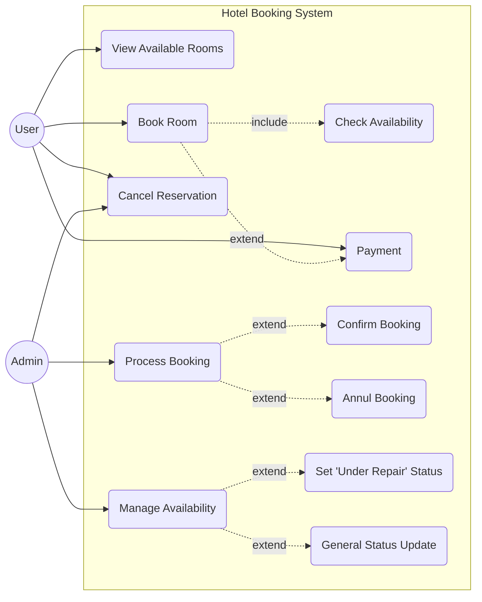
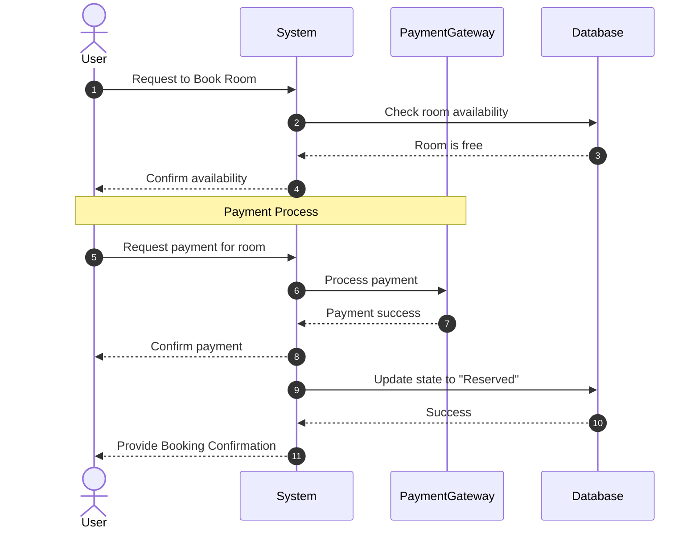

# UmlBehaviorYuzikV





```mermaid
  sequenceDiagram
    autonumber
    actor U as User
    participant S as System
    participant PG as PaymentGateway
    participant DB as Database
    actor A as Admin

    Note over U, DB: Stage_1: Reservation & Payment
    U->>S: Request to Book Room
    
    Note right of S: include: Check availability
    S->>DB: Check availability
    DB-->>S: Status free
    S-->>U: Confirm availability
    
    Note over U, PG: Payment Process
    U->>S: Request payment for room
    S->>PG: Process payment
    PG-->>S: Payment successful
    S-->>U: Confirm payment success
    
    S->>DB: Update state to "Reserved"
    DB-->>S: Success
    S-->>U: Provide Booking Confirmation

    Note over S, A: Stage_2: Admin Processing
    
    A->>S: View all bookings
    S-->>A: Show list all bookings & Confirm

    opt Annul Booking
        A->>S: Annul reservation
        S->>PG: Request payment refund
        PG-->>S: Payment refunded
        S->>DB: Revert state to "Cancelled", "Free"
        DB-->>S: Success
        S-->>U: Notify Booking Cancelled & Refunded
    end
